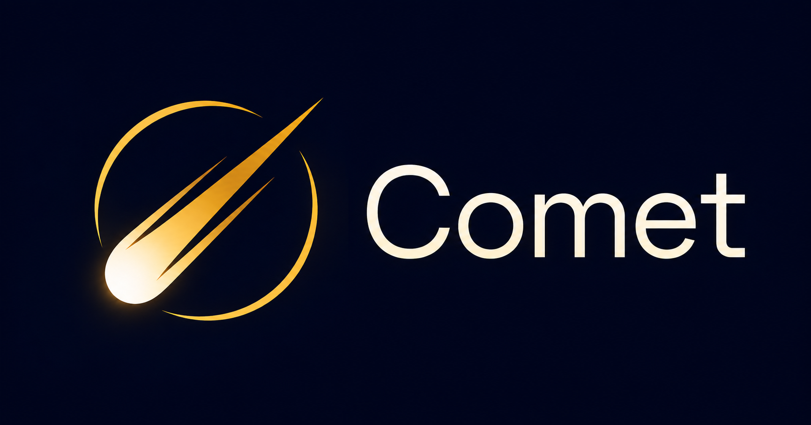
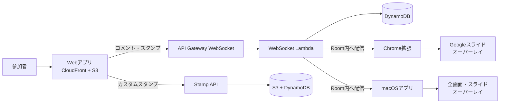

# Comet ☄️



Cometは、プレゼンテーションや配信へリアルタイムにコメントとスタンプを重ねて表示するシステムです。

参加者がWebアプリから投稿すると、同じRoomに接続したChrome拡張またはmacOSアプリへWebSocketで配信され、スライドやデスクトップ上を流れるリアルタイムオーバーレイとして表示されます。

## 主な機能

- コメントとスタンプのリアルタイム配信
- 一時的なRoomの作成と参加URL・QRコードの共有
- カスタムスタンプのアップロード、検索、削除
- コメント・スタンプ履歴の集計と表示
- Chrome拡張によるGoogleスライド上のオーバーレイ
- macOSアプリによる対象ディスプレイ全体へのクリック透過オーバーレイ
- 任意で有効化できるOIDC認証
- CloudFront + S3によるWeb配信とAWS CDKによるインフラ管理



## クイックスタート

必要な環境はNode.js 24 LTSとpnpm 10です。Node.jsの正確なバージョンは`.node-version`を参照してください。

```bash
pnpm install
pnpm --filter @comet/shared build
pnpm --filter @comet/web dev
```

Webアプリは通常 http://localhost:5173 で起動します。AWS上のWebSocketやスタンプAPIへ接続する場合は、`packages/web/.env.local` に接続先を設定してください。

```dotenv
VITE_WEBSOCKET_URL=wss://example.execute-api.ap-northeast-1.amazonaws.com/prod
VITE_STAMP_API_URL=https://example.execute-api.ap-northeast-1.amazonaws.com
```

詳しいセットアップは[ローカル開発ガイド](docs/development.md)を参照してください。

## macOSアプリ

macOS 14以降では、メニューバー常駐アプリ「Comet」を使ってコメントとスタンプをディスプレイ全体へ表示できます。Chromeに限定されないため、KeynoteやPowerPointのフルスクリーンスライド、配信画面などにもクリック透過のオーバーレイを重ねられます。出力するディスプレイ、コメント速度、サイズ、不透明度、表示領域、参加用QRコードを設定できます。

開発版を直接起動するにはApple Swift 6以降を用意し、次を実行します。

```bash
swift run --package-path packages/macos-app CometOverlay
```

ApplicationsやSpotlightから起動できる未署名アプリを作る場合は、Universal Binaryの`Comet.app`を生成します。

```bash
scripts/build-macos-app.sh
open build/macos/Comet.app
```

起動後は次の手順で接続します。

1. メニューバーのCometアイコンから「詳細設定」を開き、WebアプリURLを入力する
2. メニューバーへ戻り「接続する」を押す
3. Roomと出力先ディスプレイを選択する
4. 「オーバーレイを表示」をオンにする
5. 参加者へ投稿先を案内する場合は「参加用QRコードを表示」をオンにする

ツールバーアイコン右下のドットは、緑が接続済み、オレンジが接続中、赤が接続エラー、グレーが未接続を表します。認証が有効なWeb環境では、接続時にシステムブラウザでOIDC認証を行います。

設定、テスト表示、マルチディスプレイ、認証の詳細は[macOSアプリガイド](docs/macos-app.md)、署名・Notarization・インストール方法は[配布ガイド](docs/macos-app-release.md)を参照してください。

## ドキュメント

- [アーキテクチャ](docs/architecture.md) — システム構成、パッケージ、Roomと設定配信
- [ローカル開発](docs/development.md) — セットアップ、起動、build・test・lint
- [依存関係の更新](docs/dependency-updates.md) — Dependabot、更新間隔、CI、自動マージ方針
- [AWSへのデプロイ](docs/deployment.md) — CDK、設定ファイル、AWSプロファイル、デプロイ手順
- [Chrome拡張](docs/chrome-extension.md) — build、Chromeへの読み込み、接続設定、認証
- [macOSアプリ](docs/macos-app.md) — メニューバーアプリのbuild、起動、設定、認証
- [macOSアプリの配布](docs/macos-app-release.md) — .app作成、署名、Notarization、インストール、診断
- [OIDC認証](docs/authentication.md) — IdP、Secrets Manager、認証の有効化
- [ホスティング・認証の設計背景](docs/design/hosting-and-auth.md)

## パッケージ

| パッケージ                       | 内容                                                |
| -------------------------------- | --------------------------------------------------- |
| `packages/shared`                | 型、定数、バリデーション、共通WebSocketクライアント |
| `packages/web`                   | React + Viteの投稿・履歴Webアプリ                   |
| `packages/chrome-extension`      | Manifest V3のオーバーレイChrome拡張                 |
| `packages/macos-app`             | macOS全画面オーバーレイアプリ                       |
| `packages/api/websocket-handler` | WebSocket接続・Room・メッセージ処理Lambda           |
| `packages/api/stamp-upload`      | カスタムスタンプAPI Lambda                          |
| `packages/api/history-handler`   | Room履歴・集計API Lambda                            |
| `packages/edge-auth`             | Lambda@EdgeのOIDC認証処理                           |
| `packages/cdk`                   | AWS CDKのインフラ定義                               |

## よく使うコマンド

```bash
pnpm build
pnpm test
pnpm lint
```

GitHub ActionsはPull Requestとmainへのpushでbuild、lint、test、CDK synthを実行します。AWSへのデプロイは行いません。

## ライセンス

[MIT License](LICENSE)
