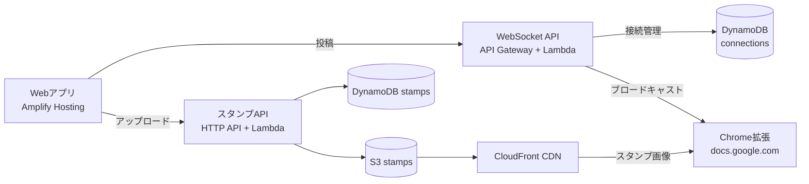

# Comet ☄️

リアルタイムコメント・スタンプシステム

Webアプリからコメント・スタンプを投稿すると、WebSocket経由で全接続端末にブロードキャストされ、Chrome拡張が投影中のページ（Googleスライドなど）にニコニコ動画風のオーバーレイとして描画します。



## パッケージ構成

pnpm workspaceのmonorepoです。

| パッケージ | 内容 |
|---|---|
| `packages/shared` | 型定義・定数・バリデーション・`CometSocket`（共通WebSocketクライアント）・`generateId` |
| `packages/web` | 投稿用Webアプリ（React + Vite） |
| `packages/chrome-extension` | オーバーレイ描画用Chrome拡張（Manifest V3、docs.google.com上でのみ動作） |
| `packages/api/websocket-handler` | WebSocket用Lambda（connect / disconnect / message） |
| `packages/api/stamp-upload` | スタンプAPI用Lambda（一覧・アップロードURL発行・削除） |
| `packages/cdk` | インフラ定義（AWS CDK、4スタック構成） |

## 開発環境

- Node.js 22 / pnpm 10
- AWS CLI（デプロイ時。プロファイルは `shimewtr` を使用）

```bash
pnpm install

# 全パッケージのビルド（shared→依存パッケージの順で解決される）
pnpm -r build

# テスト（sharedのvitest）/ lint
pnpm -r test
pnpm -r lint
```

Webアプリをローカルで動かすには `packages/web/.env.local` が必要です：

```
VITE_WEBSOCKET_URL=wss://xxxx.execute-api.ap-northeast-1.amazonaws.com/prod
VITE_STAMP_API_URL=https://xxxx.execute-api.ap-northeast-1.amazonaws.com
```

実際のURLは `cdk deploy` のOutputs（`WebSocketURL` / `StampUploadApiUrl`）を参照してください。

## CI

GitHub Actions（`.github/workflows/ci.yml`）がPRとmainへのpushで「全パッケージビルド → lint → テスト → `cdk synth`」を実行します。デプロイは行いません。

## インフラ

CDKで以下の4スタックを管理しています（環境は `--context env=dev|prod` で切り替え）：

- **StorageStack**: WebSocket接続管理のDynamoDB（TTL付き、roomId GSI）
- **WebSocketStack**: API Gateway WebSocket API + Lambda 3本
- **StampStack**: スタンプ用S3 + CloudFront + DynamoDB（category GSI） + HTTP API + Lambda
- **AmplifyStack**: WebアプリのAmplify Hosting（ビルド用に `VITE_*` 環境変数を他スタックから自動配線）

### リソース命名規則

CDK bootstrapに倣い、物理名は次の形式で統一しています（`lib/naming.ts` の `physicalName()`）：

```
comet-{env}-{リソースタイプ}-{accountId}-{region}
例: comet-dev-connections-123456789012-ap-northeast-1
```

## デプロイ

### インフラ + Lambda

```bash
# Lambdaのバンドルを最新化
pnpm --filter @comet/shared build
pnpm --filter @comet/websocket-handler build
pnpm --filter @comet/stamp-upload build

cd packages/cdk
npx cdk diff --all --context env=dev --profile shimewtr    # 事前確認
npx cdk deploy --all --context env=dev --profile shimewtr
```

注意点：

- ConnectionsTableの名前/ARNはクロススタック参照でexportされているため、テーブルの置換を伴う変更はStorageStack単独では更新できないことがあります（devなら該当スタックのdestroy→deployが早い）
- WebSocket APIを再作成するとURLが変わります。その場合は `packages/web/.env.local` の更新・web再デプロイ・拡張ポップアップのURL更新が必要です

### Web（Amplifyへの手動zipデプロイ）

AmplifyはGitリポジトリ未連携のため、ビルド成果物のzipを手動でアップロードします：

```bash
cd packages/web
pnpm build
cd dist && zip -r ../comet-web.zip . && cd ..

APP_ID=$(aws amplify list-apps --profile shimewtr --region ap-northeast-1 \
  --query "apps[?starts_with(name, 'comet-')]|[0].appId" --output text)
DEP=$(aws amplify create-deployment --app-id "$APP_ID" --branch-name main \
  --profile shimewtr --region ap-northeast-1)
curl -X PUT -T comet-web.zip "$(echo "$DEP" | jq -r .zipUploadUrl)"
aws amplify start-deployment --app-id "$APP_ID" --branch-name main \
  --job-id "$(echo "$DEP" | jq -r .jobId)" --profile shimewtr --region ap-northeast-1
```

### Chrome拡張

```bash
pnpm --filter @comet/chrome-extension build
```

`chrome://extensions` で `packages/chrome-extension/dist` を読み込み、ポップアップにWebSocket URLを設定してください。動作対象は `https://docs.google.com/*` のみです（`manifest.json` の `matches` で制限）。

## セキュリティ上のポイント

- WebSocketで受信したペイロードはサーバ側で検証し、検証済みフィールドのみブロードキャストします（コメント文字数・スタイルの許可リスト・スタンプ画像URLのCloudFront限定など。`shared/src/utils/validation.ts`）
- 拡張側でもスタンプ画像URLを許可リスト検証してから `img.src` に設定します
