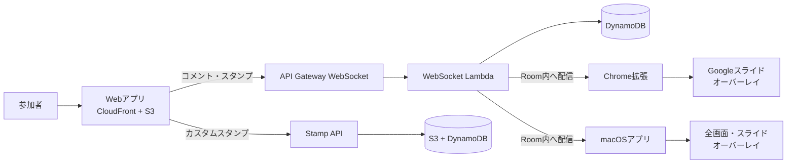

# Comet ☄️

Cometは、プレゼンテーションや配信へリアルタイムにコメントとスタンプを重ねて表示するシステムです。

参加者がWebアプリから投稿すると、同じRoomに接続したChrome拡張またはmacOSアプリへWebSocketで配信され、スライドやデスクトップ上にニコニコ動画風のオーバーレイとして表示されます。

## 主な機能

- コメントとスタンプのリアルタイム配信
- 一時的なRoomの作成と参加URL・QRコードの共有
- カスタムスタンプのアップロード、検索、削除
- コメント・スタンプ履歴の集計と表示
- Chrome拡張によるGoogleスライド上のオーバーレイ
- macOSアプリによる対象ディスプレイ全体へのクリック透過オーバーレイ
- 任意で有効化できるOIDC認証
- CloudFront + S3によるWeb配信とAWS CDKによるインフラ管理



## クイックスタート

必要な環境はNode.js 22とpnpm 10です。

```bash
pnpm install
pnpm --filter @comet/shared build
pnpm --filter @comet/web dev
```

Webアプリは通常 http://localhost:5173 で起動します。AWS上のWebSocketやスタンプAPIへ接続する場合は、`packages/web/.env.local` に接続先を設定してください。

```dotenv
VITE_WEBSOCKET_URL=wss://example.execute-api.ap-northeast-1.amazonaws.com/prod
VITE_STAMP_API_URL=https://example.execute-api.ap-northeast-1.amazonaws.com
```

詳しいセットアップは[ローカル開発ガイド](docs/development.md)を参照してください。

## ドキュメント

- [アーキテクチャ](docs/architecture.md) — システム構成、パッケージ、Roomと設定配信
- [ローカル開発](docs/development.md) — セットアップ、起動、build・test・lint
- [AWSへのデプロイ](docs/deployment.md) — CDK、設定ファイル、AWSプロファイル、デプロイ手順
- [Chrome拡張](docs/chrome-extension.md) — build、Chromeへの読み込み、接続設定、認証
- [macOSアプリ](docs/macos-app.md) — メニューバーアプリのbuild、起動、設定、認証
- [macOSアプリの配布](docs/macos-app-release.md) — .app作成、署名、Notarization、インストール、診断
- [OIDC認証](docs/authentication.md) — IdP、Secrets Manager、認証の有効化
- [ホスティング・認証の設計背景](docs/design/hosting-and-auth.md)

## パッケージ

| パッケージ                       | 内容                                                |
| -------------------------------- | --------------------------------------------------- |
| `packages/shared`                | 型、定数、バリデーション、共通WebSocketクライアント |
| `packages/web`                   | React + Viteの投稿・履歴Webアプリ                   |
| `packages/chrome-extension`      | Manifest V3のオーバーレイChrome拡張                 |
| `packages/macos-app`             | macOS全画面オーバーレイアプリ                       |
| `packages/api/websocket-handler` | WebSocket接続・Room・メッセージ処理Lambda           |
| `packages/api/stamp-upload`      | カスタムスタンプAPI Lambda                          |
| `packages/api/history-handler`   | Room履歴・集計API Lambda                            |
| `packages/edge-auth`             | Lambda@EdgeのOIDC認証処理                           |
| `packages/cdk`                   | AWS CDKのインフラ定義                               |

## よく使うコマンド

```bash
pnpm build
pnpm test
pnpm lint
```

GitHub ActionsはPull Requestとmainへのpushでbuild、lint、test、CDK synthを実行します。AWSへのデプロイは行いません。

## ライセンス

[MIT License](LICENSE)
