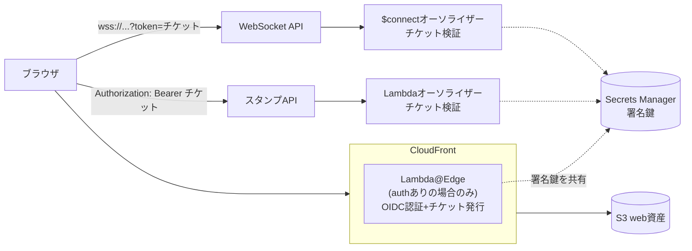

# ホスティング移行と認証のデザインドキュメント

Cometのホスティングを CloudFront + S3 に移行し、**任意で有効化できるOIDC認証**（Okta / Auth0 / Cognito など任意のIdP）と**任意のカスタムドメイン**に対応するための設計。

OSSとしてのデフォルトは「認証なし・自動ドメイン」のままとし、**利用者ごとの差分はすべて設定ファイル1枚（`packages/cdk/comet.config.json`、gitignore対象）に隔離する**。コード・リポジトリには特定の組織やデプロイ先の情報を含めない。

## 背景 / 課題

1. **APIが無認証**: WebSocket APIとスタンプAPIはURLを知っていれば誰でも投稿・アップロードできる。URLはwebのバンドルに埋め込まれるため秘匿できず、「URLを知らないこと」を防御にできない
2. **Amplify Hostingの制約**: Git連携なしの手動zipデプロイ運用で、前段に認証を挟めない（Basic認証のみ）。デプロイ手順も冗長
3. **URLが固定できない**: ホスティング/APIを作り直すとURLが変わり、QR・拡張設定・共有リンクの更新が必要になる

## 全体像（目指す構成）



### 認証の設計方針: IdPのトークンを直接使わず「自前の短命チケット」を発行する

- Lambda@EdgeがOIDC（認可コード + PKCE、client secret不要）でユーザーを認証し、セッションCookie（署名付き）を発行する
- ページのJSは `/auth/token` から **Comet自身の鍵で署名した短命JWT（チケット、有効期限≦1時間）** を取得し、WebSocket接続クエリとAPIのAuthorizationヘッダーに添付する
- バックエンド（`$connect`オーソライザー / HTTP APIオーソライザー）はSecrets Managerの共有鍵（HS256）でチケットを検証する

この方式の利点:

- **IdP非依存**: バックエンドはIdPを一切知らない。OktaのようにアクセストークンをローカルでJWT検証できないIdP（org認可サーバー）でも問題にならない
- チケットのクレーム・期限を自分で制御できる
- 認証OFF時はチケット機構ごと存在しなくなる（クライアントは`authEnabled`フラグで自動追従）

## 設定レイヤー（OSS対応の中核）

```jsonc
// packages/cdk/comet.config.json（gitignore対象。comet.config.example.json を同梱）
{
  "envs": {
    "dev": {
      "lambdaMemorySize": 256,
      "logRetentionDays": 3
    },
    "prod": {
      "lambdaMemorySize": 512,
      "logRetentionDays": 7,
      "domain": {                        // 任意。なければCloudFrontの自動ドメイン
        "domainName": "comet.example.com",
        "hostedZoneName": "example.com"  // Route 53管理の場合。証明書発行〜DNSレコードまで自動
        // "certificateArn": "arn:..."   // Route 53以外でDNS管理する場合はus-east-1の証明書ARNを直接指定
      },
      "auth": {                          // 任意。なければ認証なしの公開構成
        "issuer": "https://idp.example.com/oauth2/xxxx",
        "clientId": "xxxxx"
      }
    }
  }
}
```

- ファイルがなければ従来のデフォルト値で動く（OSS利用者は何も書かずに `cdk deploy` できる）
- `domain` / `auth` は独立に指定可能。**デプロイコマンドはどのモードでも同じ**
- `auth.clientId` はPKCEのpublic clientなので秘密情報ではない。チケット署名鍵はデプロイ時にSecrets Managerで自動生成し、利用者が秘密を扱う場面を作らない

### クライアントの自動追従

webの配信物に含まれる `/comet-config.json` はCDK（BucketDeployment）が生成し、以下を含む:

```json
{ "websocketUrl": "wss://...", "authEnabled": false }
```

- Chrome拡張は従来どおりこのファイルから接続設定を自動取得する
- webは起動時に同ファイルを読み、`authEnabled: true` なら `/auth/token` からチケットを取得してWS/APIに添付する
- **web・拡張とも同一ビルドが認証あり/なし両モードで動く**（ビルドの分岐なし）

## 段階計画とステータス

### Step 1: ホスティング移行（Amplify → CloudFront + S3） — ✅ 実装済み

- `WebStack` を新設: S3（非公開、OAI経由）+ CloudFront + `BucketDeployment`
  - SPAフォールバック（403/404 → /index.html）
  - `/comet-config.json` のみCORS許可（マネージドポリシー）+ キャッシュ無効
  - `comet-config.json` はBucketDeploymentがWebSocketStackの値から生成（インフラが正、viteプラグイン版はローカルプレビュー用フォールバック）
- webのデプロイは「`vite build` → `cdk deploy WebStack`」に統一（S3アップロードとCloudFrontキャッシュ無効化までCDKが行う）
- カスタムドメイン対応: `domain` 設定があればACM証明書（DNS検証、us-east-1）+ CloudFrontエイリアス + Route 53 Aレコードを自動作成
- AmplifyStackは廃止

### Step 2: チケット検証基盤 — ✅ 実装済み（authなしでは休眠）

- `auth` 設定がある場合のみ:
  - Secrets Managerに署名鍵 `comet-{env}-auth-signing-key` を自動生成
  - WebSocket `$connect` にRequestオーソライザー（`?token=` のチケットをHS256検証）
  - スタンプAPI（HTTP API）にLambdaオーソライザー（`Authorization: Bearer` を検証）
- クライアント:
  - `CometSocket` に `tokenProvider` オプション（接続時にトークンをクエリ付与）
  - webは `authEnabled` 時に `/auth/token` からチケットを取得してWS/APIに添付
  - 拡張はpopupのトークン欄（Step 3で web→拡張の自動連携に置き換え予定）

### Step 3: Lambda@Edge OIDC認証 — 🔜 未実装（設計のみ）

- `cloudfront.experimental.EdgeFunction`（us-east-1、認証ON利用者のみus-east-1のbootstrapが必要）
- viewer-requestで:
  - セッションCookie（署名付きJWT）を検証。なければIdPの認可エンドポイントへリダイレクト（認可コード + PKCE。`state`/`nonce`/`code_verifier`は一時Cookieで往復）
  - `/auth/callback`: コード交換 → IDトークンをIdPのJWKSで検証 → セッションCookie発行
  - `/auth/token`: セッション確認のうえ、署名鍵で短命チケットを発行して返す
- 設定（issuer/clientId/鍵ARN）はEdgeが環境変数を使えないため、アセットバンドル時に埋め込む
- 認証OFFへの切り替えは「Edge関数の関連付けを外すだけ」にして高速化（関数削除はレプリカ回収待ちが長いため行わない）
- **拡張との連携**: manifestの `externally_connectable` でwebのオリジンを許可し、認証済みのwebページから `chrome.runtime.sendMessage` でチケットを拡張に渡す（「拡張と連携」ボタン）。投影専用の長命チケット発行も代替案

### Step 4（任意）: 運用強化

- チケットの失効（署名鍵ローテーション）、`/auth/token` のレート制限
- CIのマトリクスsynth（認証あり/なし × ドメインあり/なし）で全モードの退行検知 — ✅ Step 1/2と同時に導入済み

## デプロイ手順（移行後）

```bash
# インフラ + Lambda + web配信まで一括
pnpm --filter @comet/shared build
pnpm --filter @comet/websocket-handler build
pnpm --filter @comet/stamp-upload build
pnpm --filter @comet/web build   # .env.local の VITE_WEBSOCKET_URL を使用
cd packages/cdk
npx cdk deploy --all --context env=dev --profile <your-profile>
```

- webの反映もこの1コマンドに含まれる（旧: Amplifyへの手動zipアップロードは廃止）
- 認証やドメインの有効化は `comet.config.json` を書いて同じコマンドを叩くだけ

## セキュリティ上の割り切り・注意

- 認証OFF構成（OSSデフォルト）はこれまで通り「URLを知っていれば投稿できる」。防御はサーバ側バリデーション・レート制御・画像URL許可リストのみ
- チケットはHS256の共有鍵方式。Edgeとオーソライザーだけが鍵にアクセスできる。将来的に非対称鍵（公開鍵検証）への移行も可能な構造にする
- `auth.clientId`・issuerは秘密情報ではないが、デプロイ先固有の値なのでリポジトリには含めない（configファイルで管理）
